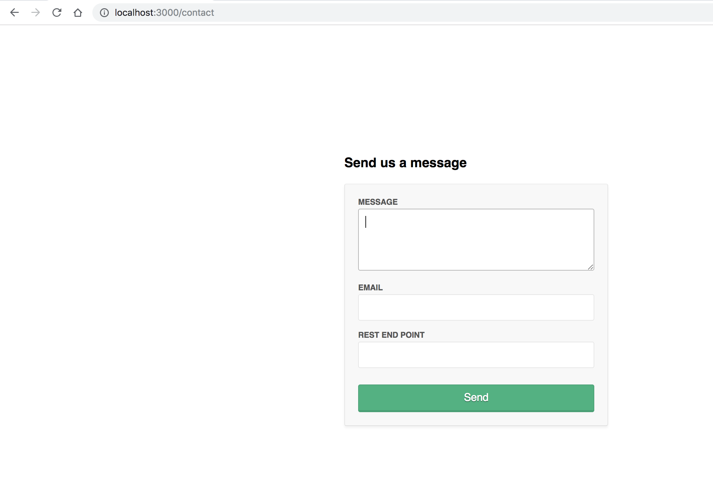
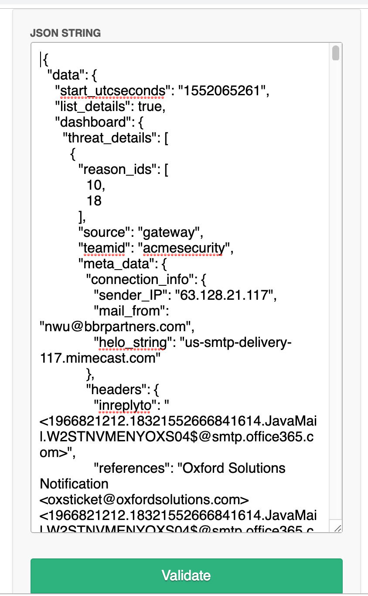
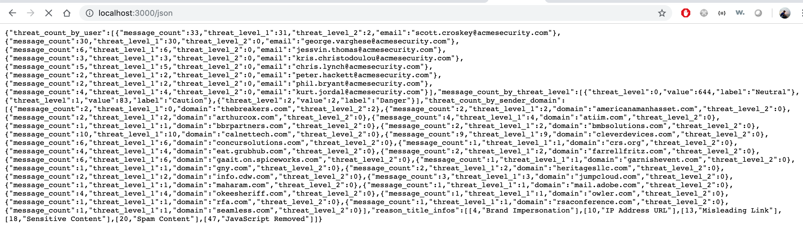

# node-app

## Usage

Clone repository 

docker build -t my-node-app .

docker run -p 3000:3000 -d my-node-app

go to browser and hit URL http://localhost:3000/contact , you must see as following 

go to browser and hit URL http://localhost:3000/json

## Developing

### Tools

Created with [Nodeclipse](https://github.com/Nodeclipse/nodeclipse-1)
 ([Eclipse Marketplace](http://marketplace.eclipse.org/content/nodeclipse), [site](http://www.nodeclipse.org))   

Nodeclipse is free open-source project that grows with your contributions.
